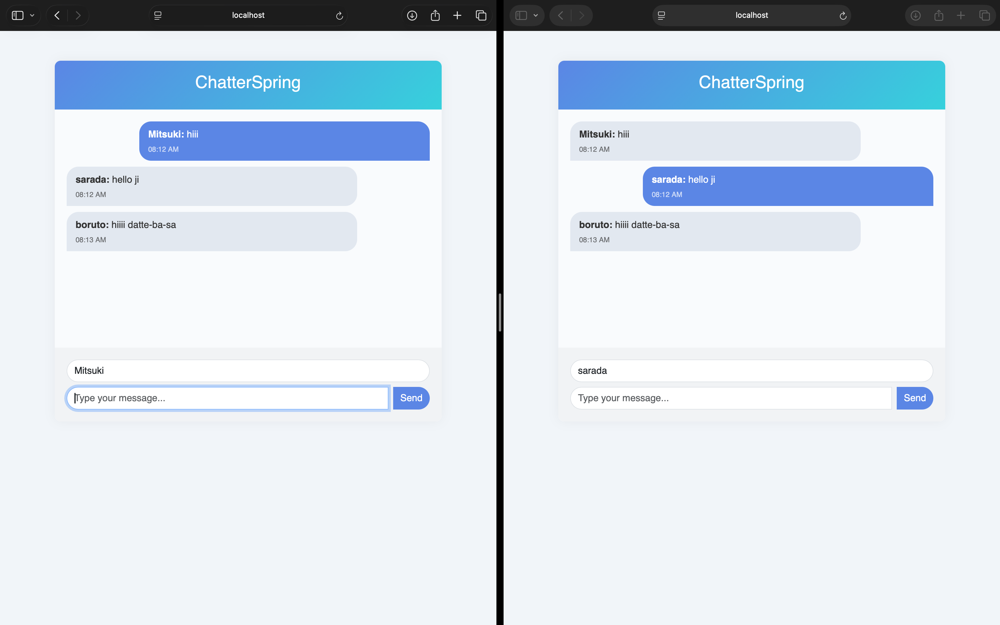
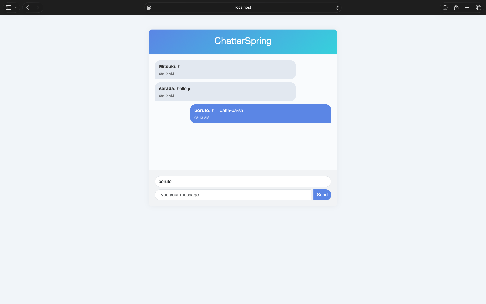

# ChatterSpring — A Simple Real-Time Chat App

Hello Ji! 
This is **ChatterSpring**, a small real-time chat application I built using **Spring Boot**, **WebSockets**, **SockJS**, and **STOMP**.  
The goal was to try out how live messaging works on the backend and connect it with a clean, responsive frontend.

---


### Here’s what it looks like:




---

##  Tech Stack

- **Backend:** Spring Boot, Spring WebSocket, STOMP protocol
- **Frontend:** Plain HTML + Bootstrap 5 + a bit of vanilla JS
- **WebSocket Client:** SockJS + STOMP.js
- **Build:** Maven

---

##  Features

- Connects multiple users in real-time
- Broadcasts messages to everyone instantly
- Clean, minimal UI with Bootstrap
- Easy to run — just clone & go!

---

---

##  How to Run

1. **Clone the repo**

   ```bash
   git clone https://github.com/your-username/ChatterSpring.git
   cd ChatterSpring

2. **Start The app**
    ```bash
   ./mvnw spring-boot:run
    http://localhost:8080/chat .


## Why I Made This

I wanted to practice real-time messaging, learn how WebSockets work in Spring Boot, and build a tiny fun project for my portfolio.
It’s nothing fancy, but a good base to build bigger chat apps later.
